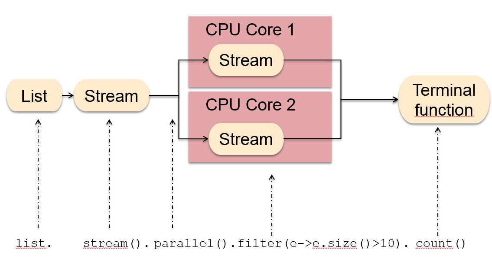

# 모던자바인액션

## 1장 - 자바 8, 9, 10, 11 : 무슨 일이 일어나고 있는가?

### 1.1. Java 8

- 자바8은 간결한 코드, 멀티코어 프로세서의 쉬운 활용이라는 2가지 요구사항을 기반으로 접근한다.
- 새로운 기술 3가지
  - Stream API
  - 동작 파라미터화 제공
  - Interface의 Default Method
- 함수형 프로그래밍의 개념을 사용하기에 용이해짐

### 1.2. 자바가 변화하는 이유

- 새로운 언어가 등장하면서 진화하지 않는 기존 언어는 사장되었다.
- 특정 분야에서 장점을 가진 언어는 다른 경쟁 언어를 도태시킨다.
- 기술은 점점 발전해나가면서, 자바는 병렬 프로세싱을 활용하기에 부족함이 많았다.
- 자바는 변화하는 환경에 빠르게 적응하기 위해 다양한 기능들을 추가로 지원함으로써, 시장에서 요구하는 기능을 효과적으로 제공할 수 있게 되었다.

### 1.3. Java 8 설계의 바탕이 되는 3가지 개념

- #### 1.3.1. Stream 처리

Stream이란 한 번에 한 개씩 만들어지는 연속적인 데이터 항목들의 모임이다.  
Stream API의 핵심은 기존에는 한 번에 한 항목을 처리했지만 자바 8에서는 고수준의 추상화를 통해서 일련의 스트림으로 만들어 처리할 수 있게 되었다는것이다.  
또한 스레드를 사용하지 않으면서도 병렬성을 얻을 수 있게 되었다.

- #### 1.3.2. 동작 파리미터화로 메서드에 코드 전달하기

자바 8에서는 메서드를 다른 메서드의 인수로 넘겨주는 기능을 제공한다.  
이런 기능을 이론적으로 동작 파라미터화라고 부른다.

- #### 1.3.3. 병렬성과 공유 가변 데이터

공유된 변수나 객체가 있으면 병렬성에 문제가 발생한다. 기존에는 synchronized를 이용해서 공유된 가변 데이터를 보호하는 규칙을 만들 수 있었으나, 자바 8의 스트림을 이용하면 기존의 자바 스레드 API보다 쉽게 병렬성을 활용할 수 있다.  
공유되지 않은 가변데이터, 메서드, 함수 코드를 다른 메서드로 전달하는 기능은 함수형 프로그래밍 패러다임의 핵심적인 사항이다.

> 언어는 하드웨어나 프로그래머 기대의 변화에 부응하는 방식으로 변화해야한다.

### 1.4. 자바 함수

프로그래밍 언어에서 함수라는 용어는 메서드, 특히 정적 메서드와 같은 의미로 사용된다.  
자바의 함수는 추가로 수학적인 함수처럼 사용되며, 부작용을 일으키지 않는 함수를 의미한다.
함수가 필요한 이유에 대해서 생각해보자.  
프로그래밍의 핵심은 값을 바꾸는 것이다. 프로그래밍 언어에서 값이란 일급시민이라고 부르며, 자바에서는 메서드나 클래스와 같은 구조체가 값의 구조를 표현하는데 도움이 된다.  
하지만 프로그램을 실행하는 동안 모든 구조체를 자유롭게 전달할 수는 없으며, 전달할 수 없는 구조체는 이급 시민이다.
여기서 메서드를 일급시민으로 만들 수 있게 되면 프로그래밍에 더욱 유용하게 사용할 수 있게 되고, 자바 8에서는 일급시민으로 바꿀 수 있는 기능이 추가되었다.

- #### 1.4.1. 메서드와 람다를 일급 시민으로

```code
File[] hiddenFiles = new File(".").listFiles(new FileFilter() {
    public boolean accept(File file) {
        return file.isHidden(); //숨겨진 파일을 필터링
    }
});
```

자바 8 이전까지는 File 클래스의 isHidden이라는 메서드를 사용하기 위해서 FileFilter로 isHidden을 감싼 다음에 FileFilter를 인스턴스화했어야 했다.  
하지만 자바 8에서는 아래처럼 구현할 수 있다.

```code
File[] hiddenFiles = new File(".").listFiles(File::isHidden);
```

isHidden함수는 이미 구현되어있으므로, 메서드참조(:: - 이 값으로 사용하라)를 이용해 listFiles에 직접 전달할 수 있다.  

기존에 객체를 생성하고 참고하여 이용해야 했었지만, 자바 8에서는 File::isHidden을 이용해서 메서드 참조를 만들어 전달할 수 있게 되었다.  

그리고 람다(익명함수)를 포함하여 함수를 값으로 취급할 수 있게 되었다.

```code
(int x) -> x + 1
```

- #### 1.4.2. 코드 넘겨주기

```code
//java8이전
// 녹색 사과를 필터링
public static List<Apple> isGreenApple(List<Apple> inventory) {
    List<Apple> result = new ArrayList<>();
    for(Apple apple : inventory) {
        if(GREEN.equals(apple.getColor()){
            result.add(apple);
        }
    }
    return result;
}

//무거운 사과를 필터링
public static List<Apple> filterHeavyApples(List<Apple> inventory) {
    List<Apple> result = new ArrayList<>();
    for(Apple apple : inventory){
        if(apple.getWeight() > 150){
            result.add(apple);
        }
    }
    return result;
}
```

```code

//java8이후
public static boolean isGreenApple(Apple apple) {
    return GREEN.equals(apple.getColor());
}

public static boolean filterHeavyApples(Apple apple) {
    return apple.getWeight() > 150;
}

public interface Predicate<T>{
    boolean test(T t);
}

static List<Apple> filterApples(List<Apple> inventory, Predicate<Apple> p) {
    List<Apple> result = new ArrayList<>();
    for(Apple apple : inventory){
        if(p.test(apple)){
            result.add(apple);
        }
    }
    return result;
}

//호출시
filterApples(inventory, Apple::isGreenApple);
filterApples(inventory, Apple::isHeavyApple);
```

- predicate : 인수로 값을 받아 true/false를 반환하는 함수

- #### 1.4.3. 메서드 전달에서 람다로

한번만 사용할 메서드는 따로 정의를 구현할 필요가 없다.

```code
filterApples(inventory, (Apple a) -> GREEN.equals(a.getColor()));
filterApples(inventory, (Apple a) -> a.getWeight() > 150);
filterApples(inventory, (Apple a) -> GREEN.equals(a.getColor()) || .getWeight() > 150);
```

하지만 람다가 길어진다면, 별도의 메서드를 정의하고 메서드 참조를 활용하는것이 바람직하다.
> 코드의 명확성이 우선시되어야 한다.

```code
//filter 활용
filter(inventory, (Apple a) -> a.getWeight() > 150);
```

### 1.5. 스트림

```code
Map<Currency, List<Transaction>> transactionsByCurrencies = new HashMap<>();

for(Transaction transaction : transactions) {
    Currency currency = transaction.getCurrency();  // 트랜잭션의 통화 추출.
    List<Transaction> transactionsForCurrency = transactionsByCurrencies.get(currency);

    if(transactionsForCurrency == null) {
        transactionsForCurrency = new ArrayList<>();
        transactionsByCurrencies.put(currency, transactionsForCurrency);
    }

    transactionsForCurrency.add(transaction);
}
```

위 코드를 아래처럼 개선할 수 있다.

```code
Map<Currency, List<Transaction>> transactionsByCurrencies = transactions.stream()
        .filter((Transaction t) -> t.getPrice() > 1000) //필터링
        .collect(groupingBy(Transaction::getCurrency)); //그룹화
```

for-each 루프틑 이용해 각 요소를 반복하면서 수행했던 방식을 외부반복, Stream API 라이브러리 내부에서 반복을 통해 처리되는 방식을 내부반복이라 한다.

- #### 1.5.1. 멀티스레딩은 어렵다

이전까지의 자바 버전에서 제공하는 스레드 API로는 멀티스레딩 코드를 구현해서 병렬성을 이용하기는 어려웠으나, 자바 8의 스트림 API를 통해서 반복적인 코드와 멀티코어 활용의 어려움이라는 문제를 해결할 수 있었다.  

위 이미지와 같은 과정을 통해서 효율적으로 CPU를 활용해서 성능향상을 할 수 있었다.  
여기서 기억해야 할 것은 컬렉션을 데이터의 접근과 저장에 중점을 두고, 스트림은 데이터에 어떤 계산을 할 것인지에 대해 중점을 둔다는 것이다.
각자의 포커스를 통해 생각할 수 있는 것은 컬렉션을 필터링 하는 가장 빠른 방법은 컬렉션을 스트림으로 바꾸고, 병렬로 처리한 다음에, 리스트로 다시 복원할 수 있다는 것이다.

### 1.6. 디폴트 메서드와 자바 모듈

디폴트메서드는 특정 프로그램을 구현하는 데 도움을 주는 기능이 아니라 미래에 프로그램이 쉽게 변화할 수 있는 환경을 제공하는 기능이다.
자바 8은 구현 클래스에서 구현하지 않아도 되는 메서드를 인터페이스에 추가할 수 있는 기능을 제공하며, 디폴트 메서드를 이용하면 기존의 코드를 건드리지 않고도 원래의 인터페이스 설계를 자유롭게 확장할 수 있다.

### 1.7. 함수형 프로그래밍에서 가져온 다른 유용한 아이디어

- 자바 8에서는 NullPointer를 피해갈 수 있도록 도와주는 Optional<T> 클래스를 제공한다.

### 1.8. 마무리

- 영원히 자바가 지배직인 위치를 유지할 수 있을지는 알 수 없다.
- 자바 8은 프로그램을 효과적이고 간결하게 구현할 수 있는 개념과 기능을 제공한다.
- 자바 8은 기존에 비해 멀티코어 프로세서를 더 잘 활용할 수 있다.
- 함수는 일급값이다.
- 자바 8의 스트림 개념중 일부는 컬렉션에서 가져온 것이다. 스트림과 컬렉션을 적절하게 활용하면 스트림의 인수를 병렬로 처리할 수 있으며, 더 가독성이 좋은 코드를 구현할 수 있다.
- 자바 9에서는 모듈을 이용해 시스템의 구조를 만들 수 있?고, 디폴트 메소드를 이용해 기존 인터페이스를 구현하는 클래스를 바꾸지 않고 인터페이스를 변경할 수 있다.
- 함수형 프로그래밍을 참고하여 null처리 방법과 패턴매칭 활용등의 기법이 추가되었다.
